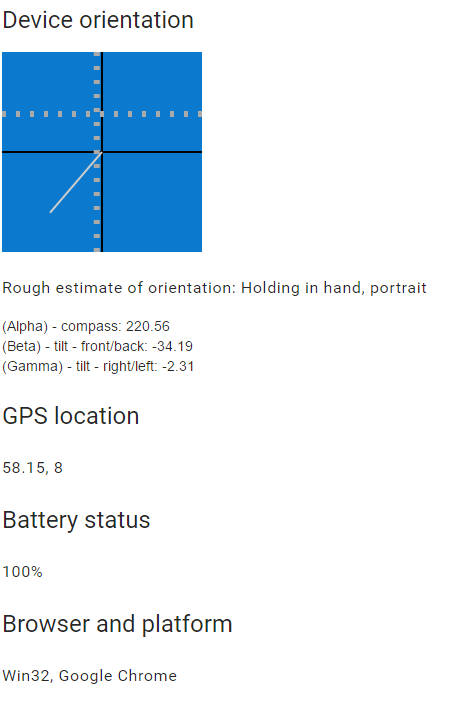

# Elm device information

A demonstration of capabilities to fetch device information from the browser
* Device orientation (tilt/direction)
* Location (must use https to function correctly)
* Browser and platform
* Battery status


## Build and run using [elm-live](https://github.com/tomekwi/elm-live)
```bash
elm-live .\src\Main.elm --output elm.js --open
```
or
## Build using elm-make
```bash
elm-make .\src\Main.elm --output elm.js
```

### Screenshot
